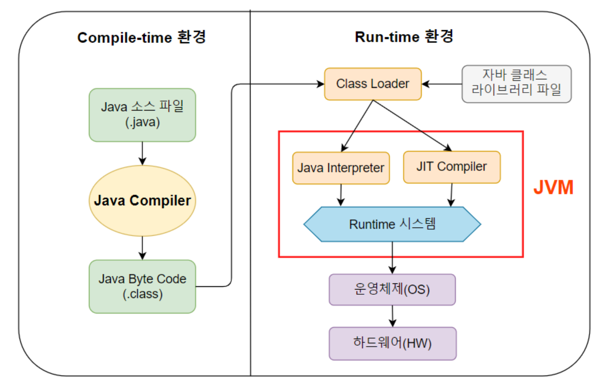

# ✨ JVM

### 📌 JVM 이란 ?

- **Java Virtual Machine**
- Java Byte Code 를 운영체제에 맞게 해석해주는 역할
- 작성한 자바 프로그램의 실행 환경을 제공하는 자바 프로그램의 구동 엔진

- Java compiler 는 `.java` 파일을 `.class` 라는 자바 바이트코드로 변환시켜준다. 하지만 바이트 코드는 기계어 (Native Code)가 아니므로 OS 에서 바로 실행이 되지 않는데, 이 때 JVM 은 OS가 Byte Code 를 이해할 수 있도록 해석해주는 역할을 담당한다. 
- **JVM을 사용하면 하나의 바이트코드로 모든 플랫폼에서 동작하도록 할 수 있다.**
- JVM은 **메모리 관리** 도 담당한다. 이를 **가비지 컬렉터 (GC)** 라고 한다. 
- 가비지 컬렉터는 Java7부터 힙 영역의 객체들을 관리하는 역할을 담당한다. 

### 📌 JVM의 메모리 구조

- 응용 프로그램이 실행되면, JVM은 시스템으로부터 프로그램을 수행하는데 필요한 메모리를 할당받고 JVM은 이 메모리를 용도에 따라 여러 영역으로 나눈다.

#### 1. Class Loader

- java에서 소스를 작성하면 `.java`파일이 생성되며, 이 소스를 컴파일하면 `.class`파일이 생성된다.
- 이렇게 생성된 `.class`파일들을 엮어서 **JVM이 운영체제로 할당 받은 메모리 영역인 Runtime Data Area로 적재(Loading)** 한다.

#### 2. Excution Engine

- 메모리에 적재된 클래스 (ByteCode) 들을 기계어 (BinaryCode)로 변경하여 명령어 단위로 실행하는 역할을 한다.
- 인터프리터 (Interpreter) 방식과 JIT (Just-In-Time) 컴파일러를 사용하는 두 가지 방식이 있다.
- **Interpreter** : 명령어를 하나씩 실행하는 대화형식 컴파일. 파이썬이 대표적인 인터프리터 언어.
- **JIT (Just-In-Time) Compiler** : 적절한 시간에 전체 바이트 코드를 네이티브 코드로 변경해서 실행하므로 성능이 인터프리터보다 속도 면에서 좋다.

#### 3. Garbage Collector

- **Heap 메모리 영역에 적재된 객체들 중 참조되지 않은 객체들을 탐색 (어플리케이션이 생성한 객체의 생존 여부) 후 제거하는 역할을 한다.**
- GC가 역할을 수행하는 시간을 정확이 언제인지 알 수 없음.
- GC가 수행되는 동안 GC를 수행하는 스레드가 아닌 다른 모든 스레드가 일시 정지된다.

#### 4. Runtime Data Area

- JVM 의 메모리 영역으로 자바 어플리케이션을 실행할 때 사용되는 데이터들을 적재하는 영역
- Method Area, Heap Area, Stack Area, PC Register, Native Method Stack 으로 나눌 수 있다.

### 📌 Runtime Data Area 영역 분류

#### 1. Method Area (메소드 영역)

- 클래스 멤버 변수의 이름, 데이터 타입, 접근 제어자 정보 같은 **field** 정보들과 메소드의 이름, return 타입, 파라미터, 접근 제어자 정보 같은 **method** 정보들, **type** 정보, **Constant Pool**, **static** 변수, **final class** 변수 등이 생성되는 영역

#### 2. Stack Area (스택 영역)

- 지역변수, 파라미터, 리턴 값, 연산에 사용되는 임시 값, 메서드 호출 등 **임시적인 데이터들**이 생성되는 영역
- **정적 메모리 할당**이 이루어지는 장소로 Heap 영역에 동적 할당된 값에 대한 참조를 얻을 수 있다.
- `Person p = new Person();` 
- 위 코드에서 `Person P` 는 **Stack** 영역, `new Persion();` 은 **Heap** 영역에 할당.

#### 3. PC Register

- 쓰레드가 생성될 때마다 생성되는 영역으로 스레드마다 하나씩 존재한다.
- 현재 쓰레드가 실행되는 부분의 주소와 명령을 저장하고 있는 영역

#### 4. Native Method Stack

- 자바 외의 언어로 작성된 Native 코드를 위한 메모리 영역
- 보통 C/C++ 등의 코드를 수행하기 위한 Stack

#### 5. MetaSpace

- 어플리케이션의 클래스나 메서드 정보, 또는  static 으로 정의된 멤버 변수가 저장된 영역
- 이전 버전의 Permanent 영역에 해당

#### 6. Code Cache

- JIT (Just-In-Time) 컴파일러가 데이터를 저장하는 영역 
- 자주 접근하는 '컴파일된 코드 블록' 이 저장됨
- 이곳에 저장된 코드는 기계어로 이미 변환된 채 Cache 되어 있어 빠르게 실행할 수 있다.

#### 7. Shared Library

- 어플리케이션에서 사용할 공유 라이브러리가 기계어로 변환된 채 저장된 영역
- 해당 OS에서 프로세스당 한 번씩 로드된다.

### 📌 JVM의 힙 영역

#### 📚 New/Young Generation

- 새로 생성된 객체를 저장한다. 

  - 객체가 힙에 최초로 할당이 되는 장소이다. 

  - **Oracle JVM 에서는 새로 생성되었거나, 생성된 지 얼마 되지 않은 객체는 Eden 영역에 저장**이 된다. Eden 영역에 일정 수준 이상으로 사용률을 보이면 GC가 발생하여 객체의 참조 여부를 따져 참조가 되어 있는 사용중인 객체라면 Survivor 영역으로 이동하고, **참조가 끊어진 Garbage 객체라면 남겨놓은 후, 사용중인 객체들이 모두 Survivor 영역으로 넘어가면 Eden 영역을 모두 청소**한다.

  - Young Generation 의 Survivor 영역은 Eden 영역에서 청소되지 않은 객체들이 할당받은 공간.

    두 개로 구성이 되며, Minor GC 라고 부른다.

    - 두 개로 구성이 되는 이유 ?
      - 하나의 Survivor 영역이 차게 되면, 다른 영역으로 복사가 된다. 이 때 Eden 영역에 있던 살아남은 객체들은 다른 Survivor 객체로 넘어가게 된다. 즉, 둘 중 하나는 반드시 비어있어야 한다. 

#### 📚 Old Generation

- 만들어진지 오래된 객체를 저장한다.
  - Survivor 영역에서 살아있는 객체로 오래 남아 있던 객체는 Old Generation 으로 이동하게 된다.
  - **특정 횟수 이상 참조가 되어 기준 Age를 초과한 객체를 의미**
  - 어떻게 설정을 하였느냐에 따라 다르지만, 오래 생성되어 있어야 하는 객체는 GC를 거치면서 Old 영역으로 이동을 하게 된다.
  - 즉, 비교적 오랫동안 참조가 되어 이용되고 있고 앞으로도 지속적으로 사용할 확률이 높은 객체들을 저장하는 영역
  - **Old Generation의 메모리도 충분하지 않으면, 해당 영역에도 GC가 발생**하는데 이를 **Full GC (Major GC)**라고 한다.

#### 📚 Permanent Generation

- JVM 클래스와 메서드 객체를 저장한다.
  - **JDK8 부터는 해당 Heap 영역이 제거**되었다. JVM에 의해 크기가 강제되던 영역이었다.
  - 대신 **MetaSpace** 영역이 추가되어 해당 영역은 **OS가 자동으로 크기를 조절한다.**
    - OS 레벨에서 관리되는 영역이므로 MetaSpace가 Native 메모리를 이용함으로써 개발자는 영역 확보의 상한을 크게 의식할 필요가 없어지게 되었다고 한다.

- Java7 HotSpot JVM 의 구조

  

- Java8 HotSpot JVM 의 구조

  

### 📌 Java 의 컴파일과 실행 과정

**빌드 시,**

1. 자바 소스 파일 `.java` 을 작성한다.
2. 자바 컴파일러 `javac.exe`를 이용하여 자바 소스 파일 `.java`을 컴파일 한다. 이 때 나오는 파일은 자바 바이트 코드 `.class` 파일로 아직 컴퓨터가 읽을 수 없으며, JVM 이 이해할 수 있는 중간 단계의 코드이다. 

**런타임 시,**

1. 바이트 코드를 JVM의 클래스 로더 (Class Loader) 에게 전달한다.
2. 클래스 로더는 동적 로딩 (Dynamic Loading)을 통해 필요한 클래스들을 로딩 및 링크하여 런타임 데이터 영역 (Runtime Data Areas), 즉 JVM의 메모리에 올린다.
3. 실행 엔진 (Execution Engine)은 JVM 메모리에 올라온 바이트 코드들을 JVM 내부에서 기계가 실행할 수 있는 형태로 변경한다. 
   - 인터프리터 (Java Interpreter)
   - JIT 컴파일러 (Just-In-Time Compiler)

https://velog.io/@dyunge_100/JAVA-JVM%EC%9D%98-%EB%A9%94%EB%AA%A8%EB%A6%AC-%EA%B5%AC%EC%A1%B0-%EB%B0%8F-%EB%8F%99%EC%9E%91-%EC%9B%90%EB%A6%AC

https://velog.io/@pearl0725/JVM%EC%9D%80-%EC%96%B4%EB%96%A4-%EC%97%AD%ED%95%A0%EC%9D%84-%ED%95%A0%EA%B9%8C

https://velog.io/@agugu95/%EC%9E%90%EB%B0%94%EC%99%80-JVM-%EA%B7%B8%EB%A6%AC%EA%B3%A0-%EB%A9%94%EB%AA%A8%EB%A6%AC-%EA%B5%AC%EC%A1%B0