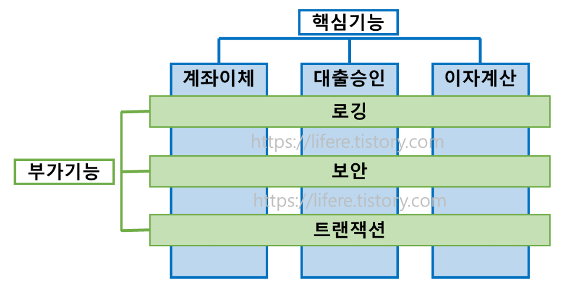
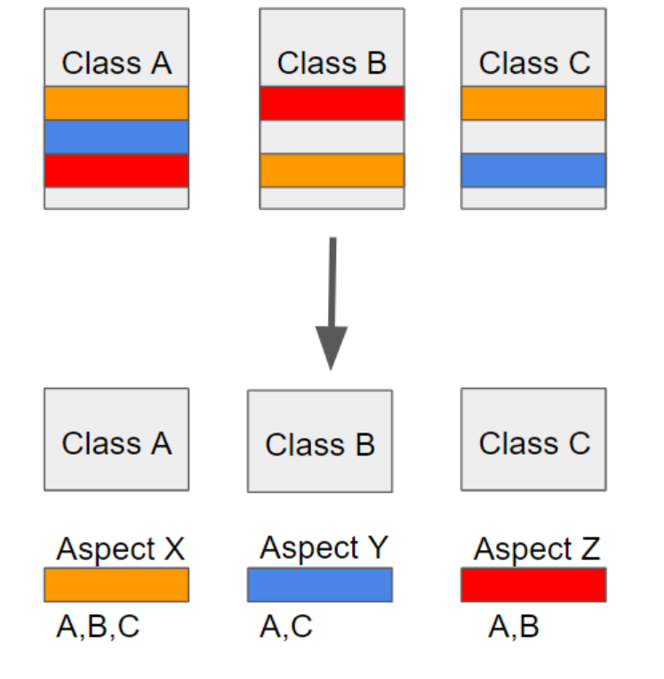
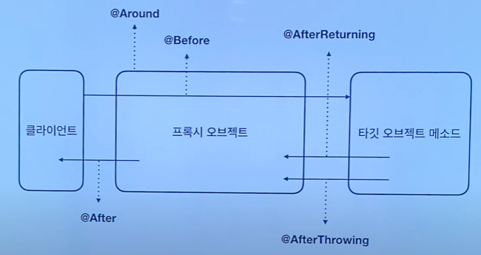
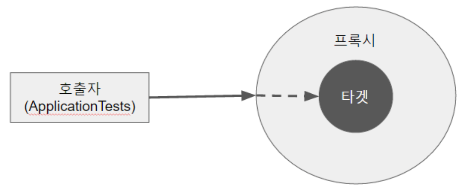

# ✨ AOP

### 📌 AOP ( Aspect Oriented Programming )

- 관점 지향 프로그래밍

- 여러 오브젝트에 나타나는 **공통적인 부가 기능**을 **모듈화**하여 **재사용**하는 기법


### 📌 핵심기능과 부가기능



- 업무 로직을 포함하는 기능을 **핵심 기능** (Core Concerns)
- 핵심기능을 도와주는 **부가적인 기능** (주로 성능검사, 트랙잭션 처리, 로깅, 보안 등) (Cross-cutting Concerns) 
- 이러한 공통적인 부가적인 기능들을 **횡단 관심사**라고 함
- 핵심기능에서 부가기능을 분리해서 모듈화하는 프로그래밍 기법 → **AOP**

```
로그를 남기거나, 핵심기능을 사용할 때 인증, 인가를 한다던가, 비즈니스 로직의 트랜잭션 처리를 하는 작업은 모든 핵심기능에 공통적으로 사용되는 기능이다. AOP는 비즈니스 로직을 나타내는 핵심기능을 작성할 때마다 공통적으로 작성하는 부가기능을 분리해서 프로그래밍하는 기법이다.
```


### 📌 AOP 의 장점

- 핵심 기능 서비스를 제외한 횡단관심사항 서비스를 별도의 모듈에서 개발하여 적용하므로, 여러 서비스에 걸쳐있는 반복적 작업을 줄일 수 있어 **생산성이 높아진다.**
- 요구사항 변경 시에도 유연하게 대처할 수 있으므로, **유지보수성이 높아진다.**


### 📌 AOP  주요 용어

- **Aspect**

  - AOP 의 단위가 되는 횡단관심사를 의미 ex) 로깅, 트랙잭션관리 등

    

- **JoinPoint**

  - 횡단관심사가 실행될 지점
  - **메서드를 호출할 때** (스프링 AOP에서)

- **Advice**

  - 횡단관심사를 처리하는 부분, 특정 JoinPoint에서 실행되는 코드
  - **어떤 부가기능**을, **언제** ?

- **Pointcut**

  - 여러 JoinPoint 중 실제 Advice를 적용할 곳을 선별하기 위한 표현식

- **Weaving**

  - 어플리케이션의 적절한 지점에 aspect를 적용하는 것을 말함

- **Target**

  - Aspect가 적용된 객체를 말한다.
  - ex) 클래스, 메서드 ..

  

### 📌 AOP Advice 유형

- **Before**
  - 메서드 실행 전에 실행하는 Advice
- **After Returning**
  - 메서드 정상 실행 후 실행하는 Advice
- **After Throwing**
  - 메서드 실행시 예외 발생시 실행하는 Advice
- **After**
  - 메서드 정상 실행 또는 예외 발생 상관없이 실행하는 Advice
  - After Returning + After Throwing
- **Around**
  - 위 네가지 Advice를 모두 포함, 모든 시점에서 실행할 수 있는 Advice




### 📌 AOP 구현 방법

1. 컴파일 시점에 코드에 공통 기능을 삽입하는 방법
2. 클래스 로딩 시점에 바이트 코드에 공통 기능을 삽입하는 방법
3. **런타임에 프록시 객체를 생성해서 공통 기능을 삽입하는 방법**


### 📌 스프링 AOP 특징

1. **프록시 기반**의 AOP 구현체
2. 스프링 빈에만 AOP 를 적용할 수 있다.
3. 동적 프록시 빈을 만들어 등록시켜준다.


### 📌 프록시 패턴

- 실제 기능을 수행하는 객체 대신 가상의 객체(proxy object)를 사용해 로직의 흐름을 제어하는 디자인 패턴.
- 클라이언트에서 타겟을 호출하게 되면 타겟이 아닌 타겟을 감싸고 있는 프록시가 호출되어, 타겟 메소드 실행 전에 선처리, 타켓 메소드 실행 후 후처리를 실행시키도록 구성되어 있음.
- AOP에서 프록시는 호출을 가로챈 후, 어드바이스에 등록된 기능을 수행 후 타겟 메서드를 실행.




### 📌 AOP 구현 예제

#### 🐥 준비

```java
// 의존성 주입

<dependency>
  <groupId>org.springframework.boot</groupId>
  <artifactId>spring-boot-starter-aop</artifactId>
</dependency>
```

```java
// 간단한 인터페이스를 구현하는 클래스 하나를 빈으로 정의

public interface EventService {
  public void created();
  public void operation();
  public void deleted();
}

```

```java
@Component
public class SimpleServiceEvent implements EventService {

  @Override
  public void created() {
    long begin = System.currentTimeMillis();
    try {
      Thread.sleep(1000);
    } catch (InterruptedException e) {
      e.printStackTrace();
    }
    System.out.println("created");
    System.out.println(System.currentTimeMillis() - begin);
  }

  @Override
  public void operation() {
    System.out.println(System.currentTimeMillis() - begin);
    try {
      Thread.sleep(2000);
    } catch (InterruptedException e) {
      e.printStackTrace();
    }
    System.out.println("operation");
    System.out.println(System.currentTimeMillis() - begin);

  }

  @Override
  public void deleted() {
    System.out.println("deleted");
  }
}
```

```java
@Component
public class AppRuner implements ApplicationRunner {

  @Autowired
  EventService eventService;

  @Override
  public void run(ApplicationArguments args) throws Exception {
    eventService.created();
    eventService.operation();
    eventService.deleted();
  }
}
```


#### 🐥 실행결과

```
created
1011
operation
2004
deleted
```


### 🐥 AOP 적용하기

```java
// 위 코드에서는 수행 시간을 재는 아래 코드가 여러 곳에서 반복 사용되고 있음

long begin = System.currentTimeMillis();
... (수행) ...
System.out.println(System.currentTimeMillis() - begin);
```

```java
// 위 코드를 하나로 묶기
// Aspect 정의
@Component
@Aspect
public class PerfAspect {

  // Advice 정의 (Around 사용)
  // Point Cut 표현식
  // (com.example.demo 밑에 있는 모든 클래스 중 EventService 안에 들어있는 모든 메쏘드에 이 행위를 적용하라.)
  @Around("execution(* com.example..*.EventService.*(..))")
  public Object logPerf(ProceedingJoinPoint pjp) throws Throwable {
    long begin = System.currentTimeMillis();
    Object retVal = pjp.proceed();
    System.out.println(System.currentTimeMillis() - begin);
    return retVal;
  }
}
```

```java
// AOP를 위 코드에서 적용했으므로, 수행시간 출력 부분 코드 삭제

@Component
public class SimpleServiceEvent implements EventService {

  @Override
  public void created() {
    try {
      Thread.sleep(1000);
    } catch (InterruptedException e) {
      e.printStackTrace();
    }
    System.out.println("created");
  }

  @Override
  public void operation() {
    try {
      Thread.sleep(2000);
    } catch (InterruptedException e) {
      e.printStackTrace();
    }
    System.out.println("operation");
  }

  @Override
  public void deleted() {
    System.out.println("deleted");
  }
}
```


#### 🐥 실행결과

```
created
1011
operation
2004
deleted
3000
```


#### 🐥 Annotation 기반

- 나는 `created()` 와 `operation()`에만 적용하고 싶은데 `delete()`에도 적용이 됐다 !
- 이를 Annotation 기반 Advice 정의로 해결하기

```java
// Annotation 만들기

@Documented
@Target(ElementType.METHOD)
@Retention(RetentionPolicy.CLASS)
public @interface PerfLogging {
}
```

```java
// Aspect 클래스 수정

@Component
@Aspect
public class PerfAspect {

  // PerfLogging 어노테이션이 달린 곳만 포인트컷 수정
  @Around("@annotation(PerfLogging)")
  public Object logPerf(ProceedingJoinPoint pjp) throws Throwable {
    long begin = System.currentTimeMillis();
    Object retVal = pjp.proceed();
    System.out.println(System.currentTimeMillis() - begin);
    return retVal;
  }
}
```

```java
// class method 수정

@Component
public class SimpleServiceEvent implements EventService {

  @PerfLogging
  @Override
  public void created() {
    ...
  }

  @PerfLogging
  @Override
  public void operation() {
    ...
  }

  @Override
  public void deleted() {
    ...
  }
}
```


#### 🐥 출력 결과

```
created
1011
operation
2004
deleted
```


### 📌 프록시 패턴 특징 예제

```java
package org.springframework.samples.petclinic.proxy;

public interface Payment {
    void pay(int amount);
}
```

```java
package org.springframework.samples.petclinic.proxy;

public class Cash implements Payment{

    public void pay(int amount){
        System.out.println(amount + " 현금 결제");
    }
}
```

```java
package org.springframework.samples.petclinic.proxy;

import org.springframework.util.StopWatch;

//프록시 클래스
public class CashPerf implements Payment{

    Payment cash = new Cash();
    
    @Override
    public void pay(int amount) {
        StopWatch stopWatch = new StopWatch();
        stopWatch.start();

        cash.pay(amount);

        stopWatch.stop();
        System.out.println(stopWatch.prettyPrint());

    }
}
```

```java
package org.springframework.samples.petclinic.proxy;

public class Store {

    Payment payment;

    public Store(Payment payment) {
        this.payment = payment;
    }

    public void butSomething(int amount){
        payment.pay(amount);
    }
}
```

```java
package org.springframework.samples.petclinic.proxy;

import org.junit.jupiter.api.Test;

import static org.junit.jupiter.api.Assertions.*;

class StoreTest {


    //Cash 클래스와 Store클래스는 바뀌지 않았지만 이 코드 앞뒤로 성능 측정을 하도록 프록시 클래스를 이용함.
    @Test
    public void testPay(){
        Payment cashPerf = new Cash();
        Store store = new Store(cashPerf);
        store.butSomething(100);
    }
}
```


### 📌 참고

https://dailyheumsi.tistory.com/202

https://dong-co.tistory.com/84

https://code-lab1.tistory.com/193