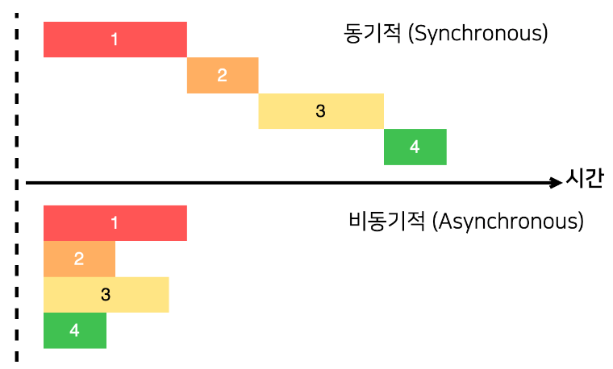
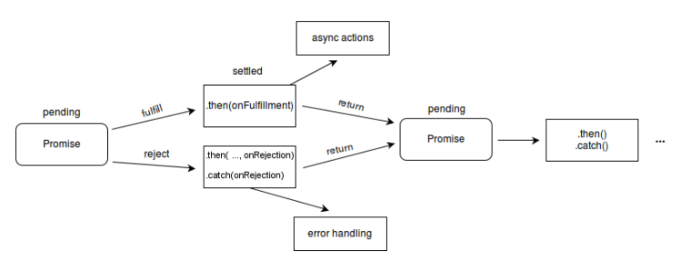

# 비동기 처리 방법


## 목차

#### - 비동기 처리란?

#### - 비동기 처리 종류

#### 	- 콜백함수(Callback function)

#### 	- 프로미스(Promise)

#### 	- async/await

#### 	- 제너레이터(Generator)


## 비동기 처리란?



#### 동기식 (Synchronous)

- 한 번에 하나의 작업만 처리
- 먼저 시작된 하나의 작업이 끝날 때까지 다른 작업을 시작하지 않고 기다렸다가 다 끝나면 새로운 작업을 시작하는 방식


#### 비동기 (Asynchronous)

- 한 번에 여러 작업을 처리
- 특정 로직의 실행이 끝날때까지 기다려주지 않고 나머지 코드를 먼저 실행하는 것
- 필요한 이유
  - 화면에서 서버로 데이터를 요청했을때 서버가 언제 그 요청에 대한 응답을 줄지 모르기 때문


## 비동기 처리 종류

#### 1. 콜백 함수 (Callback Function)

- 함수를 등록하기만 하고 어떤 이벤트가 발생했거나 특정 시점에 도달했을 때 시스템에서 호출되는 함수

  = 파라미터로 함수를 전달 받아 함수의 내부에서 실행되는 함수

- 비동기 처리 방법

```js
// cb : callback
function taskA(a, b, cb) {
  setTimeout(() => {
    const res = a + b;
    cb(res);
  }, 2000);
}

function taskB(a, cb) {
  setTimeout(() => {
    const res = a * 2;
    cb(res);
  }, 2000);
}

function taskC(a, cb) {
  setTimeout(() => {
    const res = a * -1;
    cb(res);
  }, 2000);
}

taskA(1, 2, (res_a) => {
  taskB(res_a, (res_b) => {
    taskC(res_b, (res_c) => {
      console.log("taskC Result : ", res_c);
    });
  });
});
```


#### 콜백 지옥

- 비동기 처리 로직을 위해 콜백 함수를 연속해서 사용할 때 발생하는 문제
- 가독성이 나쁘고 비동기 처리 중 발생한 에러의 처리가 곤란하며 여러 개의 비동기 처리를 한번에 처리하는 데도 한계가 존재
- 이를 해결하기 위해 Promise나 Async를 사용


#### Promise

- 비동기 연산이 종료된 이후에 결과를 알기 위해 사용하는 객체
- ES6에서 등장
- 비동기 처리 시점을 명확하게 표현할 수 있다는 장점


#### Promise의 상태

- 대기 ( pending ) : 이행하지도 거부하지도 않은 초기 상태, 비동기 함수가 실행된 상태

  ```js
  // Promise 객체를 생성하면 대기(Pending) 상태 
  new Promise();
  
  or
  
  // 호출 시 콜백 함수를 선언할 수 있으며, 인자는 resolve, reject로 하는 것이 일반적
  new Promise((resolve, reject) => {});
  ```

  

- 이행 ( fulfill ) : 연산 성공, 비동기 함수 실행 완료

  ```js
  // 콜백 함수 인자인 resolve를 실행하면 이행된(Fulfilled) 상태
  new Promise(function(resolve, reject) {
      resolve();
  });
  ```

  

- 거부 ( reject ) : 연산 실패, 비동기 함수 실행 실패

  ```js
  const Promise = new Promise((resolve, reject) => {	// 대기 상태
      getData(
      	response => resolve(response.data),			// 이행 상태
      	error => reject(error.message)				// 거부 상태
      )
  })
  ```

  


#### Promise 객체 값 반환

- **(중요) 비동기 함수는 비동기 처리 결과를 외부에 반환할 수 없고, 상위 스코프의 변수에 할당할 수도 없다!!**

- 비동기 함수의 처리 결과(서버의 응답 등)에 대한 후속 처리는 반드시 비동기 함수 내부에서 콜백함수로 수행해야 함

- **Promise 메서드 체인 (then / catch / finally)**

  - 체이닝(chaining) : 동일한 객체에 메서드를 연결할 수 있는 것
  - `then()` - 성공(resolve) 시에는 then 메서드에 실행할 콜백 함수를 인자로 넘긴다
  - `catch()` - 실패(reject) 시에는 catch 메서드에 실행할 콜백 함수를 인자로 넘긴다
  - `finally()` - 성공/실패 여부와 상관없이 모두 실행 시에는 finally 메서드에 실행할 콜백 함수를 인자로 넘긴다.

  ```js
  promise
  	.then(data => console.log(data))
  	.catch(err => console.log(err))
  	.finally(() => console.log("always run"))
  ```

  ```js
  function getData() {
    return new Promise(function(resolve, reject) {
      $.get('url 주소/products/1', function(response) {
        if (response) {
          resolve(response);
        }
        reject(new Error("Request is failed"));
      });
    });
  }
  // 위 $.get() 호출 결과에 따라 'response' 또는 'Error' 출력
  getData().then(function(data) {
    console.log(data); // response 값 출력
  }).catch(function(err) {
    console.error(err); // Error 출력
  });
  ```




#### Promise.all / Promise.race

- `Promise.all` 은 여러 작업을 동시에 처리하고, 작업이 모두 다 실행 완료되면 모두 다 반환

  ```js
  Promise.all([timer(1000), timer(2000), timer(3000)])
    .then((value) => { console.log(value); });
  // [1000, 2000, 3000] → 3000까지 모두 다 실행이 끝난 후에 다 반환
  ```

- `Promise.race` 은 실행이 가장 빠른 결과를 반환

  ```js
  Promise.race([timer(1000), timer(2000), timer(3000)])
    .then((value) => { console.log(value); });
  // 1000 → 가장 빨리 실행된 1000 반환
  ```

  

#### async / await

- 비동기 코드를 동기적인 코드인 것처럼 직관적으로 바꿔주는 역할


**참고한 사이트들**

- https://velog.io/@kim_unknown_/JavaScript-Asynchronous
- https://ryurim.tistory.com/137#:~:text=%EC%BD%9C%EB%B0%B1%20%EC%A7%80%EC%98%A5%EC%9D%80%20%EB%B9%84%EB%8F%99%EA%B8%B0%20%EC%B2%98%EB%A6%AC,%EC%82%AC%EC%9A%A9%ED%95%98%EB%8A%94%20%EB%B0%A9%EB%B2%95%EC%9D%B4%20%EC%9E%88%EC%8A%B5%EB%8B%88%EB%8B%A4.