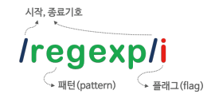

# 정규 표현식 (Regex)


#### 정규 표현식(Regular Expression)

- 일정한 패턴을 가진 문자열의 집합을 표현하기 위해 사용하는 형식 언어(formal language)
- 대부분의 프로그래밍 언어와 코드 에디터에 내장되어 있음

- 문자열을 대상으로 **패턴 매칭 기능**을 제공 => 특정 패턴과 일치하는 문자열 검색 or 추출 or 치환 가능

```js
// 사용자로부터 입력 받은 휴대폰 전화번호
const tel = '010-1234-567팔';

// 정규 표현식 리터럴로 휴대폰 전화번호 패턴을 정의
const regExp = /^\d{3}-\d{4}-\d{4}$/;

// tel이 휴대폰 전화번호 패턴에 매칭되는지 테스트(확인)
regExp.test(tel);	// false
```


#### 정규 표현식의 생성



```js
const target = 'Is this all there is?';

// 패턴 : is
// 플래그 : i => 대소문자를 구별하지 않고 검색한다
const regexp = /is/i;

// test 메서드는 target 문자열에 대해 정규 표현식 regexp의 패턴을 검색하여 매칭 결과를 boolean 값으로 반환
regexp.test(target);	// true
```

```js
// RegExp 생성자 함수를 이용한 생성
const target = 'Is this all there is?';

// new RegExp(pattern[, flags])	
// pattern: 정규 표현식의 패턴, flags : 정규 표현식의 플래그 (g, i, m, u, y)
const regexp = new RegExp(/is/i);	// ES6

regexp.test(target);	// true
```

```js
// RegExp 생성자 함수를 사용하면 동적으로 사용 가능
const count = (str, char) => (str.match(new RegExp(char, 'gi')) ?? []).length;

count('Is this all there is?', 'is');	// 3
count('Is this all there is?', 'xx');	// 0
```


#### RegExp 메서드

**1. RegExp.prototype.exec**

- `exec 메서드`는 인수로 전달받은 문자열에 대해 정규 표현식의 패턴을 검색하여 매칭 결과를 배열로 반환, 없는 경우 null을 반환

```js
const target = 'Is this all there is?';
const regExp = /is/;

regExp.exec(target);
// ["is", index: 5, input: 'Is this all there is?', groups: undefined]
```

- `exec 메서드`는 문자열 내의 모든 패턴을 검색하는 g 플래그를 지정해도 첫 번째 매칭 결과만 반환하므로 주의


**2. RegExp.prototype.test**

- `test 메서드`는 인수로 전달받은 문자열에 대해 정규 표현식의 패턴을 검색하여 매칭 결과를 boolean 값으로 반환

```js
const target = 'Is this all there is?'
const regExp = /is/;

regExp.test(target);	// true
```


**3. String.prototype.match**

- String 표준 빌트인 객체가 제공하는 `match 메서드`는 대상 문자열과 인수로 전달받은 정규 표현식과의 매칭 결과를 배열로 반환

```js
const target = 'Is this all there is?'
const regExp1 = /is/;
const regExp2 = /is/g;

target.match(regExp1);
// ["is", index: 5, input: 'Is this all there is?', groups: undefined]

target.match(regExp2);
// ["is", "is"]
```

- `match 메서드`는 g 플래그가 지정되면 모든 매칭 결과를 배열로 반환


#### 플래그

| 플래그 |    의미     |                            설명                            |
| :----: | :---------: | :--------------------------------------------------------: |
|   i    | Ignore case |            대소문자를 구별하지 않고 패턴을 검색            |
|   g    |   Global    | 대상 문자열 내에서 패턴과 일치하는 모든 문자열을 전역 검색 |
|   m    | Multi line  |        문자열의 행이 바뀌더라도 패턴 검색을 계속함         |

- 플래그는 선택적으로 사용 가능
- 순서와 상관없이 하나 이상의 플래그를 동시에 설정 가능
- 기본적으로 대소문자를 구별해서 패턴을 검색하고, 문자열에 패턴 검색 매칭 대상이 1개 이상 존재해도 첫 번째 매칭한 대상만 검색하고 종료

```js
const target = 'Is this all there is?';

// is 문자열을 대소문자를 구별하여 한 번만 검색
target.match(/is/);
// ["is", index: 5, input: 'Is this all there is?', groups: undefined]

// is 문자열을 대소문자를 구별하지 않고 한 번만 검색
target.match(/is/i);
// ["is", index: 0, input: 'Is this all there is?', groups: undefined]

// is 문자열을 대소문자를 구별하여 전역 검색
target.match(/is/g);
// ["is", "is"]

// is 문자열을 대소문자를 구별하지 않고 전역 검색
target.match(/is/ig);
// ["Is", "is", "is"]
```


#### 패턴

- 패턴은 **`/`**로 열고 닫으며 문자열의 **따옴표는 생략**
- 특별한 의미를 가지는 **메타문자** 또는 **기호**로 표현 가능


**1. 임의 문자열 검색**

- **`.`**은 임의의 문자 한개를 의미

```js
const target = 'Is this all there is?';

// 임의의 3자리 문자열을 대소문자를 구별하여 전역 검색
const regExp = /.../g;

target.match(regExp);
// ["Is ", "thi", "s a", "ll ", "the", "re ", "is?"]
```


**2. 반복 검색**

- `{m,n}`은 앞선 패턴이 최소 m번, 최대 n번 반복되는 문자열을 의미
  - 콤마 뒤에 공백이 있으면 정상 동작하지 않으므로 주의!!

```js
const target = 'A AA B BB Aa Bb AAA';

// 'A'가 최소 1번, 최대 2번 반복되는 문자열을 전역 검색
const regExp = /A{1,2}/g;

target.match(regExp);	// ["A", "AA", "A", "AA", "A"]
```

- `{n}`은 앞선 패턴이 n번 반복되는 문자열을 의미

```js
const target = 'A AA B BB Aa Bb AAA';

// 'A'가 2번 반복되는 문자열을 전역 검색
const regExp = /A{2}/g;

target.match(regExp);	// ["AA", "AA"]
```

- `{n,}`은 앞선 패턴이 최소 n번 이상 반복되는 문자열을 의미

```js
const target = 'A AA B BB Aa Bb AAA';

// 'A'가 최소 2번 이상 반복되는 문자열을 전역 검색
const regExp = /A{2,}/g;

target.match(regExp);	// ["AA", "AAA"]
```

- `+`는 앞선 패턴이 최소 한번 이상 반복되는 문자열을 의미
  - 즉, `+`는 `{1,}`과 같다

```js
const target = 'A AA B BB Aa Bb AAA';

// 'A'가 최소 한 번 이상 반복되는 문자열을 전역 검색
const regExp = /A+/g;

target.match(regExp);	// ["A", "AA", "A", "AAA"]
```

- `?`는 앞선 패턴이 최대 한 번(0번 포함) 이상 반복되는 문자열을 의미
  - 즉, `?`는 `{0,1}`과 같다

```js
const target = 'color colour';

// 'colo' 다음 'u'가 최대 한 번(0번 포함) 이상 반복되는 문자열을 전역 검색
const regExp = /colou?r/g;

target.match(regExp);	// ["color", "colour"]
```


**3. OR 검색**

- `|`은 or의 의미를 갖는다

```js
const target = "A AA B BB Aa Bb"

// 'A' 또는 'B'를 전역 검색
const regExp = /A|B/g;
target.match(regExp);	// ["A", "A", "A", "B", "B", "B", "A", "B"]
```

- 분해되지 않은 단어 레벨로 검색하기 위해서는 `+`를 함께 사용

```js
const target = "A AA B BB Aa Bb"

// 'A' 또는 'B'가 한 번 이상 반복되는 문자열을 전역 검색
const regExp = /A+|B+/g;
target.match(regExp);	// ["A", "AA", "B", "BB", "A", "B"]
```

- `[]` 내의 문자는 or로 동작

```js
const target = "A AA B BB Aa Bb"

// 'A' 또는 'B'가 한 번 이상 반복되는 문자열을 전역 검색
const regExp = /[AB]+/g;
target.match(regExp);	// ["A", "AA", "B", "BB", "A", "B"]
```

- 범위를 지정하려면 `[]` 내에 `-`를 사용

```js
// 대문자 알파벳 검색
const regExp = /[A-Z]+/g;

// 대소문자 구별 없이 알파벳 검색
const regExp = /[A-Za-z]+/g;

// 숫자 검색
const regExp = /[0-9]+/g;
or
const regExp = /[\d]+/g;
```

```js
const target = 'AA BB 12,345';

// 숫자가 아닌 문자 또는 ','가 한 번 이상 반복되는 문자열 전역 검색
const regExp = /[\D,]+/g;
target.match(regExp);	// ["AA BB ", ","]
```

- `\w`는 알파벳, 숫자, 언더스코어를 의미
  - 즉, `\w`는 `[A-Za-z0-9_]`와 같다
- `\W`는 반대로 동작
  - 즉, `\W`는 알파벳, 숫자, 언더스코어가 아닌 문자를 의미

```js
const target = 'Aa Bb 12,345 _$%&';

// 알파벳, 숫자, 언더스코어, ','가 한 번 이상 반복되는 문자열 전역 검색
let regExp = /[\w,]+/g;

target.match(regExp);	// ["Aa", "Bb", "12,345", "_"]

// 알파벳, 숫자, 언더스코어가 아닌 문자 또는 ','가 한 번 이상 반복되는 문자열을 전역 검색
regExp = /[\W,]+/g;

target.match(regExp);	// [" ", " ", ",", " $%&"]
```


**4. NOT 검색**

- `[...]` 내의 `^`은 not의 의미를 가짐
  - ex) `[^0-9]`는 숫자를 제외한 문자를 의미 (=`\D`)


**5. 시작 위치로 검색**

- `[...]` 밖의 `^`은 문자열의 시작을 의미
  - 단, `[...]` 내의 `^`은 not의 의미를 가지므로 주의

```js
const target = 'https://poiemaweb.com';

// 'https'로 시작하는지 검사
const regExp = /^https/;

regExp.test(target);	// true
```


**6. 마지막 위치로 검색**

- `$`는 문자열의 마지막을 의미

```js
const target = 'https://poiemaweb.com';

// 'com'으로 끝나는지 검사
const regExp = /com$/;

regExp.test(target);	// true
```


#### 자주 사용하는 정규표현식 (p.589)

**1. 특정 단어로 시작하는지 검사**


